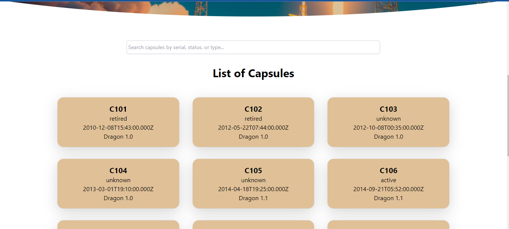

# CapsuleX

A Exam proctoring website bootstrapped with [Create React App](https://github.com/facebook/create-react-app).

## Table of contents

- [Overview](#overview)
  - [The challenge](#the-challenge)
  - [Screenshot](#screenshot)
  - [Links](#links)
- [My process](#my-process)
  - [Built with](#built-with)
  - [What I learned](#what-i-learned)
  - [Useful resources](#useful-resources)

## Overview

### The challenge

Users should be able to:

- View the list of capsules
- Search for capsules based on serial, type or status
- View details of each capsules
- View optimal layout based on the screen device

### Screenshot




### Videos


### Links

- Solution URL: (https://github.com/faozziyyah/Faozziyyah_Daud__JuniorFE)
- Live Site URL: (https://sdproctor.github.io/sdproctor/)

## My process
### Built with

- CSS
- [React](https://reactjs.org/) - React: JS library
- [Typescript](https://www.typescriptlang.org/) - Typed programming language that builds on JavaScript
- [TailwindCSS](https://tailwindcss.com/) - A utility-first CSS framework

### What I learned

```React.js
  
    useEffect(() => {
      
      const fetchCapsules = async () => {

        try {
          
            const response = await fetch(url);
            if (!response.ok) {
                throw new Error('Failed to fetch data');
            }
            const data: Capsule[] = await response.json();
            setCapsules(data);
            setIsLoading(false);

        } catch (error) {
            setError(error instanceof Error ? error.message : 'An unknown error occurred');
            setIsLoading(false);
        }
    };
  
      fetchCapsules()
    }, [ currentPage ])
```
```React.js
    <ReactPaginate
        pageCount={Math.ceil(filteredCapsules.length / n)}
        onPageChange={handlePageChange}
        containerClassName="pagination"
        activeClassName="active"
    />
```

### Useful resources

In the project directory, you can run:

### `npm install` 

then...

### `npm start`

Runs the app in the development mode.\
Open [http://localhost:3000](http://localhost:3000) to view it in your browser.

The page will reload when you make changes.\
You may also see any lint errors in the console.
